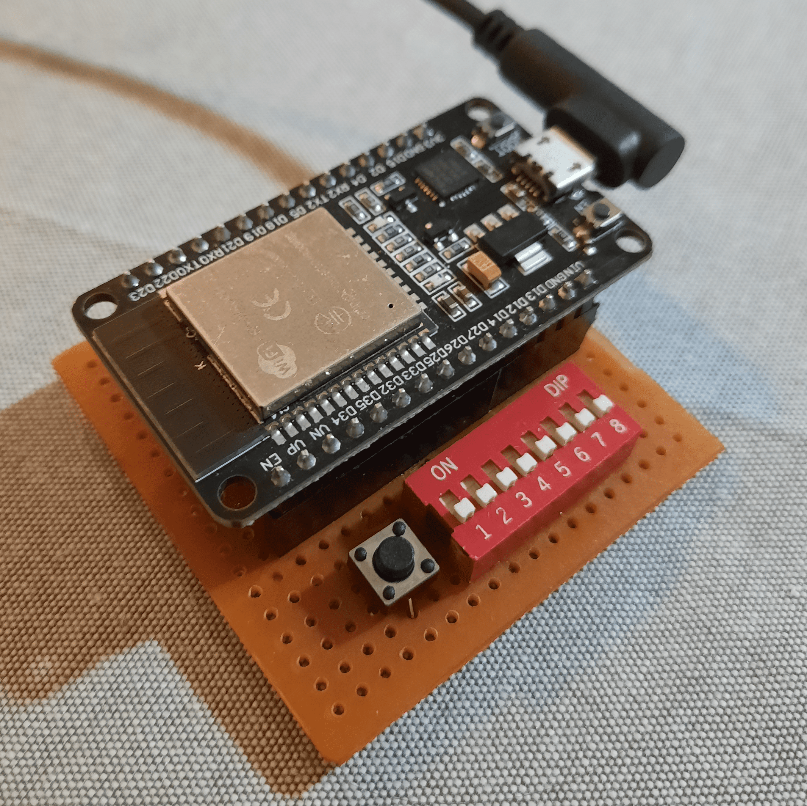

# PS/2 to Bluetooth Keyboard Converter

During my internship, I did research on Bluetooth Human Interface Device profile and implemented a Bluetooth keyboard on an ESP32 microcontroller. The project provided here is a fork of `esp_hid_device` example which comes with Espressif IoT Development Framework (ESP-IDF). My code implements typing strings of characters on the connected device and can be used for logging and debugging. I also wrote a PS/2 keyboard driver, but it was not included in the final version, because for some reason the prototype I soldered stopped working. 

